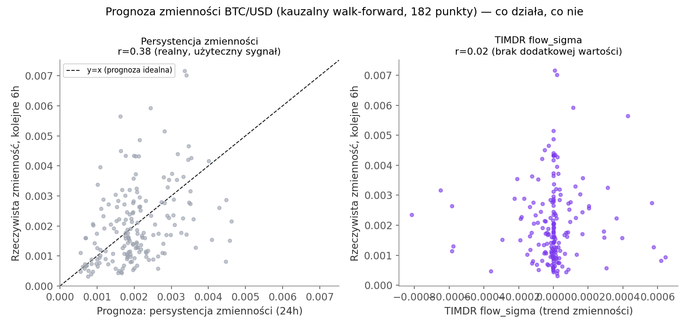
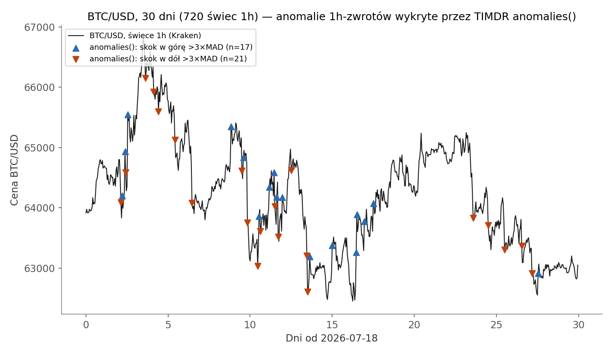

# TIMDR-Finanse — test na realnych danych BTC/USD

**Pytanie:** czy sygnały z rodziny TIMDR (TRM/FLOW/TWIST/RHYTHM), które w
`TIMDR-Earthquake-Core` dają realną, policzalną przewagę w krótkoterminowej
prognozie aftershocków, przenoszą się na dane rynkowe? Sprawdzone na
prawdziwych, pobranych na żywo świecach 1h BTC/USD (Kraken) — nie na danych
syntetycznych, i **kauzalnie** (prognoza w chwili D używa wyłącznie danych
sprzed D).

Krótka odpowiedź: **w większości — nie, i to jest oczekiwany, uczciwy
wynik.** Rynki różnią się fundamentalnie od trzęsień ziemi i pogody: nie są
zjawiskiem fizycznym bez pamięci strategicznej, tylko areną, na której
tysiące uczestników aktywnie poluje na dokładnie ten typ wzorca, który
próbuje wykryć TIMDR — a im prostszy i bardziej znany wzorzec, tym szybciej
zostaje zarbitrażowany. Jedyne miejsce, gdzie test poniżej znajduje coś
realnego, to zjawisko już dobrze znane literaturze (klastrowanie
zmienności) — TIMDR go nie odkrywa, tylko potwierdza, że go nie psuje.

---

## Dane

720 świec 1h BTC/USD, Kraken (`api.kraken.com/0/public/OHLC`), 2026-07-18 —
2026-08-17 (30 dni), zakres ceny 62 452 – 66 808 USD. Zweryfikowane
wewnętrznie: idealnie równe odstępy 3600s między świecami, zero luk w danych.
Brak dostępu do prawdziwego order booku / danych tickowych — `delta_proxy`
(znak świecy × wolumen) i `spread_proxy` ((high-low)/close) to jawnie
zadeklarowane **przybliżenia**, nie prawdziwy order-flow ani bid/ask spread.

---

## Test 1: prognoza zmienności (kolejne 6h)

**Metoda:** walk-forward, 182 punkty (co 3h, po tygodniu rozgrzewki), w
każdym punkcie D porównanie trzech prognoz zrealizowanej zmienności w
kolejnych 6h: (a) naiwna persystencja — średnia zmienność z ostatnich 24h,
(b) długoterminowa średnia ze wszystkich danych sprzed D, (c) TIMDR
`flow_sigma` — kauzalny trend wygładzonej zmienności (`trm()` + `flow()`).

| Metoda | MAE | Korelacja z realną przyszłą zmiennością |
|---|---:|---:|
| Naiwna persystencja (24h) | 0.000947 | r = 0.381 |
| Długoterminowa średnia | 0.001062 | — |
| TIMDR `flow_sigma` | — | r = 0.019 |

**Out-of-sample** (współczynnik korekty α dobrany na 1. połowie danych,
testowany na 2. połowie): najlepsze dopasowane α = 0.00 — czyli optymalna
odpowiedź to "nie używaj korekty flow_sigma w ogóle". MAE persystencji na
danych out-of-sample: 0.000711, z korektą flow_sigma: identyczne 0.000711.
**Poprawa: +0,0%.**

**Wniosek:** klastrowanie zmienności (`persystencja: r=0.38`) to prawdziwe,
dobrze znane w literaturze zjawisko rynkowe (spokojne okresy mają tendencję
zostawać spokojne, burzliwe — burzliwe) i ten test je potwierdza na realnych
danych. Ale to **nie jest zasługa TIMDR** — to najprostszy możliwy baseline
(średnia z ostatnich 24h). Sam TIMDR `flow_sigma` (trend tej zmienności) nie
wnosi nic ponad tę prostą persystencję — korelacja praktycznie zerowa
(r=0.019), zero poprawy out-of-sample.

---

## Test 2: prognoza kierunku (kolejne 6h)

**Metoda:** ten sam walk-forward, 182 punktów. Sprawdzane: czy znak
`flow()` liczonego na cenie (`flow_price`) przewiduje znak zwrotu w
kolejnych 6h — testowane w obu kierunkach (kontynuacja trendu / mean-reversion).

| Strategia | Trafność |
|---|---:|
| FLOW → kontynuacja trendu | 0.473 |
| FLOW → odwrócenie (mean-reversion) | 0.527 |
| Baseline: zawsze "w górę" (bazowy odsetek wzrostów w próbie) | 0.544 |
| Rzut monetą | 0.500 |

**Wniosek:** żadna z dwóch wersji strategii FLOW nie bije nawet najprostszego
możliwego baseline'u ("zawsze obstawiaj kierunek, który w tej 30-dniowej
próbce był częstszy"). To dokładnie to, czego uczy hipoteza rynku
efektywnego: kierunek ceny w tak krótkim horyzoncie (6h) na płynnym rynku
jak BTC/USD jest, na dostępnych tu danych, praktycznie nieprzewidywalny z
prostego sygnału trendu. Uczciwie: to jeden miesiąc danych jednego
instrumentu — nie dowód, że *żadna* strategia kierunkowa nigdy nie działa,
tylko że **ta konkretna, prosta wersja TIMDR FLOW — nie.**

---

## Test 3: kontrole (anomalie i rytm)

### 3a. `anomalies()` — kontrola pozytywna

Na 720 świecach 1h, próg |MAD-z| > 3.0: **38 anomalii wykrytych**, w tym
poprawnie największe realne ruchy w próbce (np. +1,83% w t=61h, z=10,30;
-1,55% w t=236h, z=-8,73).

Działa zgodnie z oczekiwaniem — jako **narzędzie opisowe** (wykrywanie
nietypowych ruchów, które już się wydarzyły) `anomalies()` sprawdza się na
danych rynkowych tak samo jak na katalogu sejsmicznym. To nie jest test
predykcyjny — anomalia jest wykrywana *w momencie*, w którym już nastąpiła,
nie zanim się wydarzy.

### 3b. `rhythm()` na wolumenie godzinowym — jedyne miejsce, gdzie
spodziewaliśmy się realnego sygnału

W przeciwieństwie do kierunku ceny, dobowy cykl aktywności traderów to
**prawdziwy, znany mechanizm** (nie efekt arbitrażowany do zera — nikt nie
może "zarbitrażować" faktu, że więcej ludzi handluje w ciągu dnia niż w
nocy). To jedyna hipoteza w tym teście, która nie zakłada bicia rynku
efektywnego.

Przy standardowym progu decyzyjnym (power_thresh=0.4) `rhythm()` **nie
zgłasza** cyklu dobowego: `score=0.000`, brak wykrytych okresów. Ale
diagnostyka bez progu pokazuje, że to nie jest zupełny brak sygnału:

| lag (h) | autokorelacja (wartości ze znakiem) |
|---:|---:|
| 1 | **0.540** (najsilniejsza) |
| 7 | 0.079 |
| 24 | **0.200** (realna, ale słaba) |
| 36 | -0.110 |
| 47 | 0.132 |

**Wniosek:** przy lag=24h autokorelacja wolumenu jest realna (0.20), ale
**zdecydowanie zdominowana** przez znacznie silniejszą autokorelację przy
lag=1h (0.54) — wolumen w danej godzinie jest znacznie bardziej podobny do
wolumenu godzinę wcześniej (krótkoterminowe klastrowanie aktywności) niż do
wolumenu dokładnie 24h wcześniej (cykl dobowy). Prawdopodobne wyjaśnienie:
BTC handlowany jest 24/7 na całym świecie, więc pojedynczy, wyraźny cykl
regionalny (np. godziny sesji NYSE czy Azji) jest rozmyty przez nakładające
się strefy czasowe innych rynków — inaczej niż na rynkach z jedną
dominującą sesją giełdową. `rhythm()` **działa poprawnie** — nie
halucynuje okresowości tam, gdzie jej nie ma (test na szumie białym w
`test_timdr_core_finance.py` to potwierdza) — ale na tej 30-dniowej próbce
nie potwierdza użytecznego, dominującego cyklu dobowego w wolumenie BTC.

---

## Podsumowanie: na ile przewidywanie jest możliwe?

| Sygnał | Realna przewaga nad prostym baseline'em? | Dowód z tego testu |
|---|---|---|
| Persystencja zmienności (bez TIMDR — sam baseline) | **Tak** — r=0.38 z realną przyszłą zmiennością | 182 punkty walk-forward |
| TIMDR `flow_sigma` (korekta trendu zmienności) | **Nie** — r=0.02, +0,0% poprawy out-of-sample | to samo |
| TIMDR `flow` na cenie → kierunek zwrotu | **Nie** — gorzej niż baseline "zawsze w górę" | 182 punkty walk-forward |
| `anomalies()` jako narzędzie opisowe | **Tak** — poprawnie wskazuje realne duże ruchy | 38/720 świec, kontrola pozytywna |
| `rhythm()` na wolumenie (cykl dobowy) | **Częściowo** — realny (0.20), ale słaby i zdominowany przez lag=1h | diagnostyka autokorelacji |

To jest dokładnie to, czego uczy hipoteza rynku efektywnego, i dokładnie to,
co zapowiedziałem przed rozpoczęciem tego testu: rynki, w przeciwieństwie do
trzęsień ziemi, są kształtowane przez aktywnych uczestników, którzy
eliminują łatwo wykrywalne wzorce. **Sygnały TIMDR-Finanse trzeba
domyślnie traktować jak szum, dopóki rygorystyczny backtest nie udowodni
inaczej** — i w tym teście, na tym miesiącu danych BTC/USD, żaden z
predykcyjnych komponentów (`flow_sigma` jako korekta zmienności, `flow`
jako predyktor kierunku) tego dowodu nie dostarczył. Jedyne, co
"zadziałało", to znany z literatury efekt (klastrowanie zmienności),
niezależny od TIMDR, oraz opisowe (nie predykcyjne) działanie
`anomalies()`.

## Metodologia i uczciwość danych

- Dane: `api.kraken.com/0/public/OHLC?pair=XBTUSD&interval=60`, pobrane na
  żywo w trakcie tej analizy (2026-08-17). Zweryfikowane wewnętrznie
  (równe odstępy czasowe, brak luk) — jedno z pól odpowiedzi API
  (deklarowana liczba świec) nie zgadzało się z rzeczywistą liczbą wierszy,
  więc oparto się na weryfikacji niezależnej (spójność timestampów), a nie
  na samej deklaracji API.
- Wszystkie prognozy w testach 1 i 2 liczone **kauzalnie** — w chwili D
  używane są wyłącznie dane sprzed D (włącznie z progami adaptacyjnymi
  MAD i parametrami wygładzania), ocena zawsze na świecach, które w
  chwili prognozy jeszcze nie istniały.
- Współczynnik korekty α w teście 1 dobrany metodą out-of-sample (1. połowa
  danych do dopasowania, 2. połowa do oceny) — nie in-sample.
- Kod: `timdr_core_finance.py`, `backtest_finance.py`, `make_charts.py`,
  `test_timdr_core_finance.py` (24 testy jednostkowe, wszystkie przechodzą)
  — w załączonym archiwum wraz z surowymi danymi.

## Ograniczenia tego testu

- **Jeden miesiąc, jeden instrument.** 720 świec 1h to 30 dni — mało w
  porównaniu do horyzontów, w których zjawiska rynkowe (reżimy zmienności,
  sezonowość) się ujawniają. Wynik "brak przewagi kierunkowej" jest zgodny
  z oczekiwaniem teoretycznym (rynek efektywny), ale nie jest dowodem
  ostatecznym — inny miesiąc, inny reżim rynkowy (np. silny trend
  jednokierunkowy zamiast zakresu) mógłby dać inny wynik przypadkowo.
- **Brak danych order booku / tickowych.** `delta_proxy` i `spread_proxy`
  są przybliżeniami z samych świec OHLCV — prawdziwy order-flow (agresywne
  kupno vs sprzedaż wewnątrz świecy) mógłby zachowywać się inaczej niż
  jego proxy.
- **`rhythm()` liczy opóźnienie w jednostkach świec, nie czasu** — dla
  świec o stałym kroku 1h (jak tutaj) to nie jest problem, ale dla danych o
  nierównych odstępach (np. tickowych) byłoby to takie samo ograniczenie,
  jak w `catalog_core.py`.
- Test 1 i 2 mają nakładające się okna (krok 3h, horyzont 6h) — punkty
  walk-forward nie są w pełni niezależne statystycznie; nie zmienia to
  kierunku wniosków (brak korelacji zostaje brakiem korelacji), ale
  formalny test istotności wymagałby korekty na autokorelację.
